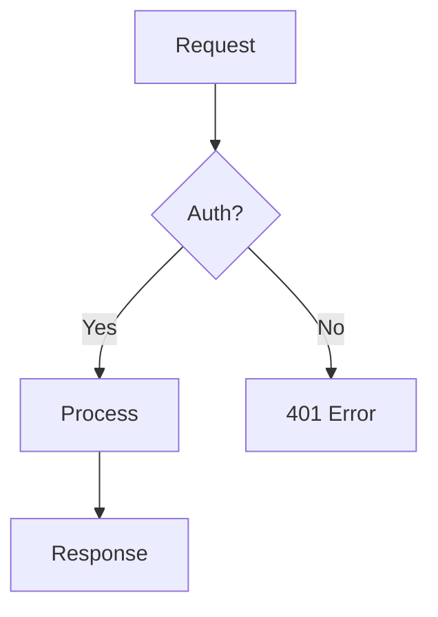

# Visual Diagrams

## Proposito

Uma imagem vale mais que mil palavras — especialmente quando se trata de arquitetura de software,
fluxos de dados, ou processos complexos. Esta skill instrui o Claude a gerar diagramas visuais
de forma proativa e eficaz para acelerar a compreensao.

A equipa do Claude Code na Anthropic usa esta tecnica regularmente: pedir diagramas ASCII para
protocolos, diagramas HTML para explicar codebases desconhecidas, e ate apresentacoes visuais
rapidas para partilhar conhecimento. Segundo Boris Cherny, isto "acelera dramaticamente a
compreensao visual de processos complexos".

---

## Quando Usar

### Reactivo (o utilizador pede)
- "Faz um diagrama da arquitetura"
- "Mostra o fluxo de autenticacao"
- "Visualiza a relacao entre estas tabelas"
- "Desenha o pipeline de CI/CD"

### Proativo (o Claude oferece)
- Apos explicar uma arquitetura com 3+ componentes
- Depois de executar uma sequencia complexa de operacoes
- Quando ha relacoes entre entidades que sao dificeis de descrever em texto
- Durante revisao de codigo para mostrar o fluxo de dados
- Ao apresentar opcoes de arquitetura (diagramas A vs B)

A regra e simples: se te parece que um diagrama ajudaria, oferece um. O custo de gerar e baixo
e o valor de compreensao e alto.

---

## Formatos Disponíveis

### 1. ASCII Art (Inline)

O mais rapido e universal — funciona em qualquer terminal, chat, ou ficheiro de texto.
Ideal para diagramas simples e respostas rapidas.

```
┌─────────┐     ┌──────────┐     ┌──────────┐
│  Client  │────▶│  API GW  │────▶│  Service │
└─────────┘     └──────────┘     └──────────┘
                      │                │
                      ▼                ▼
                ┌──────────┐     ┌──────────┐
                │   Auth   │     │    DB    │
                └──────────┘     └──────────┘
```

Caracteres uteis: `─ │ ┌ ┐ └ ┘ ├ ┤ ┬ ┴ ┼ ▶ ▼ ◀ ▲ ● ○ ═ ║`

**Quando usar:** Respostas rapidas no chat, comentarios em codigo, documentacao em texto.

### 2. Mermaid (Ficheiro .mermaid)

Diagramas estruturados que renderizam automaticamente em GitHub, Notion, e muitos editores.
Bom equilibrio entre simplicidade e visual.



Tipos suportados: `graph`, `sequenceDiagram`, `classDiagram`, `stateDiagram`, `erDiagram`,
`gantt`, `pie`, `flowchart`.

**Quando usar:** Documentacao em repositorios, PRs, ADRs, qualquer contexto com rendering Mermaid.

### 3. HTML Interativo (Ficheiro .html)

Para diagramas ricos com cores, interatividade, ou quando se quer algo que impressione.
Usar CSS grid/flexbox ou bibliotecas como D3.js para layout.

**Quando usar:** Apresentacoes, explicacoes de codebase para onboarding, dashboards de arquitectura.

### 4. SVG (Ficheiro .svg)

Graficos vetoriais escaláveis — perfeitos para documentacao formal ou embedding em sites.

**Quando usar:** Documentacao tecnica formal, diagramas que precisam de escala sem perda de qualidade.

---

## Tipos de Diagrama por Contexto

| Contexto | Tipo Recomendado | Formato |
|----------|------------------|---------|
| Arquitetura de sistema | Component diagram | Mermaid graph ou ASCII |
| Fluxo de autenticacao | Sequence diagram | Mermaid sequenceDiagram |
| Schema de base de dados | ER diagram | Mermaid erDiagram |
| Pipeline CI/CD | Flowchart | Mermaid flowchart ou ASCII |
| Estado de uma feature | State diagram | Mermaid stateDiagram |
| Timeline de projeto | Gantt chart | Mermaid gantt |
| Fluxo de dados | Data flow diagram | ASCII ou Mermaid graph |
| Dependencias entre modulos | Dependency graph | Mermaid graph |
| Explicacao de codigo apos execucao | Step-by-step flow | ASCII inline |
| Comparacao de opcoes | Side-by-side | ASCII ou HTML |

---

## Principios de Design

### Clareza sobre Beleza
O diagrama existe para comunicar, nao para impressionar. Um diagrama ASCII claro e mais
util que um SVG bonito mas confuso.

### Hierarquia Visual
- Fluxo principal: linha grossa ou setas cheias (──▶)
- Fluxos secundarios: linha fina ou tracejada (--->)
- Componentes criticos: destaque com bordas duplas (═══) ou cor
- Componentes externos: bordas tracejadas

### Regra dos 7±2
O diagrama nao deve ter mais de 5-9 componentes principais. Se precisar de mais,
dividir em sub-diagramas com referencias cruzadas.

### Direcao Consistente
- Top-down: para hierarquias e fluxos de processo
- Left-right: para pipelines e sequencias temporais
- Nunca misturar direcoes no mesmo diagrama

### Legendas
Se o diagrama usa simbolos, cores, ou estilos diferentes, incluir uma legenda.
Nao assumir que o leitor conhece as convencoes.

---

## Exemplos por Cenario

### Apos Explicar Arquitetura

Quando acabas de descrever como os componentes interagem:

```
"Aqui esta um diagrama da arquitectura que acabamos de discutir:"

┌─────────────────────────────────────────────┐
│                   Frontend                   │
│              (Next.js + React)               │
└──────────────────┬──────────────────────────┘
                   │ API calls
                   ▼
┌──────────────────────────────────────────────┐
│              API Gateway (tRPC)               │
├──────────────┬───────────────┬───────────────┤
│   Auth       │   Business    │   Webhooks    │
│  Middleware  │    Logic      │   Handler     │
└──────┬───────┴───────┬───────┴───────┬───────┘
       │               │               │
       ▼               ▼               ▼
┌──────────┐   ┌──────────┐    ┌──────────┐
│  Clerk   │   │ Postgres │    │  Stripe  │
│  (Auth)  │   │  (Data)  │    │(Payments)│
└──────────┘   └──────────┘    └──────────┘
```

### Apos Sequencia Complexa no Terminal

Quando executaste varios comandos e o utilizador pode estar perdido:

```
"Aqui esta o que acabou de acontecer:"

  1. npm install     2. prisma migrate    3. seed database
     ┌───────┐          ┌───────┐           ┌───────┐
     │  pkg  │ ──────▶  │schema │ ──────▶   │ data  │
     │ json  │          │  .sql │           │ ready │
     └───────┘          └───────┘           └───────┘
        ✓                  ✓                   ✓

  4. build app       5. run tests         6. start dev
     ┌───────┐          ┌───────┐           ┌───────┐
     │ .next │ ──────▶  │ pass  │ ──────▶   │ :3000 │
     │ build │          │ 42/42 │           │  live │
     └───────┘          └───────┘           └───────┘
        ✓                  ✓                   ✓
```

---

## Anti-Padroes

- **Diagrama demasiado complexo** — se tem mais de 9 componentes, dividir em sub-diagramas
- **Diagrama sem contexto** — explicar sempre o que o diagrama mostra antes de o apresentar
- **Formato errado para o contexto** — ASCII no chat, Mermaid em repos, HTML para apresentacoes
- **Falta de direcao** — setas sem labels em diagramas com multiplos fluxos confundem
- **Nunca oferecer diagramas** — a tendencia natural e so usar texto; combater ativamente

---

## Relacao com Outras Skills

- **senior-architect** — Diagramas de arquitectura complementam decisoes arquitecturais
- **architecture-patterns** — Visualizar patterns (hexagonal, clean architecture)
- **database-design** — ER diagrams para schemas
- **concise-planning** — Diagramas de fluxo para planos de execucao
- **deployment-procedures** — Diagramas de pipeline CI/CD
- **kaizen** — Oferecer diagramas proativamente faz parte da melhoria continua
