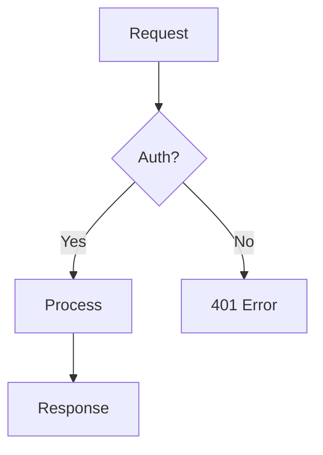

# Architecture

> Phase 2 — From requirements to structural design.

---

## 1. Architecture Principles

### Core SOLID Principles

#### Separation of Concerns (SoC)
Every module, class, or function should address a single part of the overall functionality. Never mix data access logic with business rules or presentation logic. When a component does more than one thing, split it.

#### Single Responsibility Principle (SRP)
A class or module should have exactly one reason to change. If you find yourself describing what a module does using the word "and," it likely violates SRP. Refactor until each unit owns a single, well-defined behavior.

#### Dependency Inversion Principle (DIP)
High-level modules must not depend on low-level modules. Both should depend on abstractions (interfaces or types). This decouples your business logic from infrastructure concerns like databases, HTTP frameworks, and third-party services.

#### Open/Closed Principle
Modules should be open for extension but closed for modification. Favor composition, strategy patterns, and plugin architectures over modifying existing, tested code.

#### Least Astonishment
Design APIs and interfaces so that their behavior matches what a developer would reasonably expect. Surprising behavior introduces bugs.

---

## 2. Monolith vs Microservices Decision Framework

| Factor | Choose Monolith | Choose Microservices |
|---|---|---|
| Team size | Small (1-8 developers) | Large (multiple autonomous teams) |
| Domain complexity | Single, well-understood domain | Multiple distinct bounded contexts |
| Deployment frequency | Uniform release cadence | Independent deployment per service |
| Operational maturity | Limited DevOps capability | Strong CI/CD, observability, orchestration |
| Performance requirements | Low-latency internal calls needed | Network latency between services is acceptable |
| Data consistency | Strong consistency across features | Eventual consistency is tolerable |

**Default recommendation**: Start with a well-structured monolith. Extract services only when there is a clear organizational or scaling reason to do so. Premature decomposition into microservices adds operational complexity without proportional benefit.

---

## 3. Scalability & Performance

### Vertical vs Horizontal Scaling
- **Vertical**: Increase resources on a single machine. Simpler but has hard limits.
- **Horizontal**: Add more instances behind a load balancer. Requires stateless design.

### Statelessness
Design services so that any instance can handle any request. Store session data in external stores (Redis, database) rather than in-memory. This is a prerequisite for horizontal scaling.

### Caching Strategy
- **Application-level**: In-memory caches (LRU) for hot data within a single process.
- **Distributed cache**: Redis or Memcached for shared state across instances.
- **CDN**: For static assets and cacheable API responses.
- **Cache invalidation**: Define TTLs and invalidation triggers. Stale data is a common source of bugs.

### Database Scaling
- Read replicas for read-heavy workloads.
- Connection pooling (PgBouncer, Supabase built-in pooler).
- Partitioning and sharding for very large datasets.
- Consider eventual consistency where strong consistency is not required.

---

## 4. Layered Architecture (Clean Architecture)

Organize code into layers with strict dependency direction (outer layers depend on inner layers, never the reverse):

### Layer 1 — Domain / Entities
Pure business objects and rules. No dependencies on frameworks, databases, or I/O. This layer changes only when business rules change.

### Layer 2 — Application / Use Cases
Orchestrates domain objects to fulfill a specific user action. Defines input/output boundaries (DTOs). Depends only on domain layer abstractions.

### Layer 3 — Infrastructure / Adapters
Implements interfaces defined by inner layers. Contains database repositories, HTTP clients, message queue consumers, file system access. All framework-specific code lives here.

### Layer 4 — Presentation / Delivery
HTTP controllers, CLI handlers, GraphQL resolvers. Translates external input into use case calls and formats responses.

### Dependency Rule
Dependencies always point inward. The domain layer never imports from infrastructure. Use dependency injection to provide concrete implementations at runtime.

### Practical File Structure
```
src/
  domain/
    entities/
    value-objects/
    errors/
  application/
    use-cases/
    interfaces/       # Repository and service interfaces
    dtos/
  infrastructure/
    repositories/     # Concrete implementations
    services/
    config/
  presentation/
    http/
      controllers/
      middleware/
      routes/
```

---

## 5. Design Patterns Catalog

### Clean Architecture

**When to Use**
- Medium to large applications where business logic must survive framework changes.
- Projects with multiple delivery mechanisms (REST API, CLI, message queue consumer).
- Teams that need clear boundaries for parallel development.

**Key Benefits**
- Framework independence — swap Express for Fastify without rewriting business logic.
- Testability — test use cases without touching the database.
- Team scalability — clear contracts allow parallel development.

---

### Domain-Driven Design (DDD)

**When to Use**
- Complex business domains with rich rules that go beyond CRUD.
- Projects where domain experts and developers need a shared language.
- Systems with multiple subdomains that need clear boundaries.

**Core Concepts**

**Ubiquitous Language**
Use the same terminology in code, documentation, and conversations with stakeholders. If the business says "policy," the code has a `Policy` class, not a `Rule` or `Config`.

**Bounded Contexts**
A bounded context is a boundary within which a particular domain model is defined and applicable. The same real-world concept (e.g., "Customer") may have different representations in different contexts (Sales vs Support). Do not force a single shared model across contexts.

**Aggregates**
A cluster of domain objects treated as a single unit for data changes. Every aggregate has a root entity that controls access. External objects reference the aggregate only through the root.

Rules:
- Each aggregate enforces its own invariants.
- Transactions should not span multiple aggregates.
- Reference other aggregates by ID, not by direct object reference.

**Entities**
Objects with a unique identity that persists over time. Two entities with the same attributes but different IDs are different objects. Example: two users with the same name are still different users.

**Value Objects**
Objects defined by their attributes, not identity. Two value objects with the same attributes are interchangeable. Example: `Money(100, "USD")` equals another `Money(100, "USD")`. Value objects are immutable.

**Domain Events**
Something that happened in the domain that other parts of the system care about. Example: `OrderPlaced`, `PaymentReceived`, `SubscriptionCancelled`. Use events to decouple bounded contexts.

**Domain Services**
Operations that do not naturally belong to any single entity or value object. Example: `PricingService.calculateDiscount(order, customer)`.

**Repositories**
Abstractions for persisting and retrieving aggregates. The domain defines the interface; the infrastructure provides the implementation. A repository should feel like an in-memory collection.

**Anti-Patterns to Avoid**
- **Anemic domain model**: Entities that are just data bags with getters/setters while all logic lives in services. Push behavior into entities.
- **God aggregate**: An aggregate that encompasses too many entities. Keep aggregates small and focused.
- **Shared kernel overuse**: Sharing too much code between bounded contexts creates tight coupling.

---

### Hexagonal Architecture (Ports and Adapters)

**When to Use**
- Applications that need to be testable without external dependencies.
- Systems that must support multiple input/output mechanisms.
- Teams that want explicit boundaries between application logic and the outside world.

**Core Concepts**

**The Hexagon (Application Core)**
Contains all business logic. Knows nothing about the outside world. Defines ports (interfaces) that describe how it wants to interact with external systems.

**Ports**
Interfaces defined by the application core. Two types:
- **Driving ports (primary)**: How the outside world triggers the application. Example: `CreateUserPort` with method `execute(input): output`.
- **Driven ports (secondary)**: How the application accesses external resources. Example: `UserRepository`, `EmailSender`, `PaymentGateway`.

**Adapters**
Concrete implementations that connect to the ports:
- **Driving adapters**: HTTP controllers, CLI handlers, message queue consumers, scheduled jobs. They call driving ports.
- **Driven adapters**: PostgreSQL repository, SMTP email sender, Stripe payment adapter. They implement driven ports.

**Testing Advantage**
Replace any driven adapter with a test double (in-memory repository, mock email sender) without changing the application core. Test business logic in isolation.

---

### Pattern Comparison

| Aspect | Clean Architecture | DDD | Hexagonal |
|---|---|---|---|
| Primary focus | Layer separation and dependency direction | Domain modeling and strategic design | Port/adapter isolation for testability |
| Key concept | Dependency rule (inward only) | Bounded contexts and aggregates | Ports (interfaces) and adapters (implementations) |
| Best for | Applications needing framework independence | Complex business domains | Systems needing high testability and multiple I/O channels |
| Complexity cost | Medium — requires clear layer boundaries | High — requires domain expertise and modeling effort | Medium — requires discipline in port/adapter definitions |
| Team prerequisite | Understanding of SOLID principles | Access to domain experts, willingness to invest in modeling | Comfort with interfaces and dependency injection |
| Can combine with others | Yes, often combined with DDD concepts | Yes, tactical patterns fit inside Clean/Hexagonal layers | Yes, naturally complements Clean Architecture |

**Decision Guide**
1. **Simple CRUD app**: None of these patterns is necessary. Use a straightforward MVC or service-layer approach.
2. **Medium complexity, single domain**: Clean Architecture or Hexagonal. Pick based on team familiarity.
3. **High complexity, multiple subdomains**: DDD for strategic design, combined with Clean or Hexagonal for tactical implementation.
4. **Need extreme testability**: Hexagonal provides the most explicit mechanism for swapping dependencies.

**Common Mistakes**
- Applying DDD to a CRUD application. The overhead is not justified.
- Creating too many layers for a small project. Two layers (domain + infrastructure) are often sufficient.
- Treating these patterns as rigid frameworks rather than guidelines. Adapt to your context.
- Over-abstracting: creating interfaces for things that will never have a second implementation. Be pragmatic.

---

## 6. Error Handling Strategy

### Classification
- **Operational errors**: Expected failures (network timeout, invalid input, not found). Handle gracefully with appropriate HTTP status codes and user-facing messages.
- **Programmer errors**: Bugs (null reference, type mismatch). These should crash the process in development and be caught by global error handlers in production.

### Implementation Guidelines
1. Define a base `AppError` class with `statusCode`, `code`, `message`, and optional `details`.
2. Create specific error subclasses: `ValidationError`, `NotFoundError`, `AuthorizationError`, `ConflictError`.
3. Use a global error handler middleware that catches all errors, logs them, and returns a consistent JSON response.
4. Never expose internal stack traces or implementation details to the client.
5. Always log the full error context (stack trace, request ID, user ID) server-side.
6. Use structured logging (JSON format) so errors are searchable and parseable.

### Error Response Format
```json
{
  "error": {
    "code": "RESOURCE_NOT_FOUND",
    "message": "The requested user was not found.",
    "details": {}
  }
}
```

### Retry and Circuit Breaker
For external service calls, implement retry with exponential backoff. After repeated failures, use a circuit breaker pattern to fail fast and avoid cascading failures. Libraries like `cockatiel` (Node.js) provide these primitives.

---

## 7. System Design Checklist

Before writing any code for a new system or feature, answer these questions:

1. **Requirements clarity** — Are functional and non-functional requirements documented?
2. **Data model** — What are the core entities, their relationships, and access patterns?
3. **API contract** — Are the endpoints, request/response shapes, and error formats defined?
4. **Authentication and authorization** — Who can access what? What is the auth mechanism?
5. **Error handling** — How are errors surfaced to the user and logged internally?
6. **Observability** — What metrics, logs, and traces will you capture?
7. **Deployment** — How will the system be deployed, scaled, and rolled back?
8. **Data migration** — Are there existing data or schema changes needed?
9. **Third-party dependencies** — What external services does this depend on? What are their SLAs?
10. **Failure modes** — What happens when a dependency is unavailable?

---

## 8. Database Design

### Normalization Rules

Normalization eliminates redundancy and ensures data integrity. Apply these forms sequentially.

#### First Normal Form (1NF)
- Each column contains atomic (indivisible) values.
- No repeating groups or arrays stored in a single column.
- Each row is unique (has a primary key).

**Violation**: A `tags` column containing `"react,typescript,nextjs"`.
**Fix**: Create a separate `tags` table and a join table `post_tags`.

#### Second Normal Form (2NF)
- Satisfies 1NF.
- Every non-key column depends on the entire primary key, not just part of it.
- Relevant when using composite primary keys.

**Violation**: A table `(order_id, product_id, product_name, quantity)` where `product_name` depends only on `product_id`.
**Fix**: Move `product_name` to a `products` table.

#### Third Normal Form (3NF)
- Satisfies 2NF.
- No non-key column depends on another non-key column (no transitive dependencies).

**Violation**: A table `(employee_id, department_id, department_name)` where `department_name` depends on `department_id`, not on `employee_id`.
**Fix**: Move `department_name` to a `departments` table.

#### When to Denormalize
Denormalization is a deliberate tradeoff: storage and write complexity for read performance.

- **Read-heavy dashboards**: Materialized views or precomputed summary tables.
- **Avoiding expensive joins**: Storing a `user_name` alongside `user_id` in a `comments` table when you always display both.
- **Counters and aggregates**: A `follower_count` column on `profiles` instead of counting the `followers` table every read.
- **Event logs and audit trails**: These are append-only and naturally denormalized.

Always document why you denormalized. Add a comment in the migration.

---

### Index Strategy

#### When to Create Indexes
- Columns used in `WHERE` clauses frequently.
- Columns used in `JOIN` conditions.
- Columns used in `ORDER BY` with `LIMIT` (pagination).
- Foreign key columns (PostgreSQL does not auto-index these).

#### When NOT to Index
- Small tables (under a few thousand rows). Sequential scan is faster.
- Columns with very low cardinality (e.g., a boolean `is_active` with 50/50 distribution).
- Write-heavy tables where index maintenance cost outweighs read benefit.

#### Index Types in PostgreSQL
- **B-tree** (default): Equality and range queries. Use for most cases.
- **GIN**: Full-text search, JSONB containment, array operations.
- **GiST**: Geometric data, range types, full-text search (alternative to GIN).
- **BRIN**: Very large tables with naturally ordered data (e.g., timestamp columns on append-only tables).

#### Composite Indexes
Column order matters. A composite index on `(tenant_id, created_at)` supports queries filtering by `tenant_id` alone or by `tenant_id AND created_at`, but NOT by `created_at` alone. Place the most selective column first.

#### Partial Indexes
Index only a subset of rows. Useful for queries that always include a condition:
```sql
CREATE INDEX idx_active_users ON users (email) WHERE is_active = true;
```

---

### Common Schema Patterns

#### Polymorphic Associations
A single table references different parent tables.

**Approach A — Separate foreign keys**:
```sql
-- comments table
commentable_type TEXT NOT NULL,  -- 'post' or 'video'
post_id UUID REFERENCES posts(id),
video_id UUID REFERENCES videos(id),
CHECK (
  (commentable_type = 'post' AND post_id IS NOT NULL AND video_id IS NULL) OR
  (commentable_type = 'video' AND video_id IS NOT NULL AND post_id IS NULL)
)
```

**Approach B — Shared interface table** (preferred for complex cases):
Create a `commentable_items` table that all commentable entities reference via a shared ID.

#### Entity-Attribute-Value (EAV)
Stores arbitrary key-value pairs for an entity. Flexible but hard to query and validate.
```sql
entity_id UUID, attribute_name TEXT, attribute_value TEXT
```

**Use sparingly**. Prefer JSONB columns in PostgreSQL for semi-structured data — you get indexing (GIN) and validation (check constraints) without the query complexity of EAV.

#### Adjacency List (Tree Structures)
Each row has a `parent_id` referencing another row in the same table.
```sql
id UUID PRIMARY KEY,
name TEXT NOT NULL,
parent_id UUID REFERENCES categories(id)
```

Simple to implement. Recursive queries (`WITH RECURSIVE`) handle tree traversal. For very deep or frequently queried trees, consider **materialized path** (`path TEXT` like `/1/4/12/`) or **closure table** patterns.

#### Soft Deletes
Add a `deleted_at TIMESTAMPTZ` column instead of actually deleting rows. Filter with `WHERE deleted_at IS NULL` in all queries. Create a partial index on frequently queried columns that excludes soft-deleted rows.

---

### ORM Comparison

| Feature | Prisma | Drizzle | TypeORM |
|---|---|---|---|
| Type safety | Excellent (generated client) | Excellent (schema-first TS) | Moderate (decorators, runtime types) |
| Schema definition | `schema.prisma` DSL | TypeScript files | TypeScript decorators or YAML |
| Migration approach | Auto-generated from schema diff | SQL-based or push | Auto-generated or manual SQL |
| Raw SQL support | `$queryRaw` and `$executeRaw` | First-class SQL builder | Query builder and raw SQL |
| Performance | Good, some overhead from client | Minimal overhead, close to raw SQL | Higher overhead, complex query generation |
| Learning curve | Low — declarative schema is intuitive | Medium — requires SQL knowledge | Medium — decorator-heavy, many concepts |
| Edge/serverless | Supported (with adapter) | Excellent (lightweight) | Poor (heavy initialization) |
| Community/ecosystem | Large, well-funded, extensive docs | Growing rapidly, modern approach | Mature but less actively developed |

**Recommendation**
- **Prisma**: Best for teams that want a batteries-included experience with excellent DX and documentation. Watch for N+1 queries.
- **Drizzle**: Best for teams that want type safety with full SQL control and minimal runtime overhead. Ideal for edge and serverless.
- **TypeORM**: Consider only for existing projects already using it. Not recommended for new projects due to maintenance pace and runtime weight.

---

### Migration Best Practices

#### General Rules
1. Every schema change goes through a migration. Never modify the database manually in production.
2. Migrations must be idempotent where possible. Use `IF NOT EXISTS`, `IF EXISTS` guards.
3. Migrations must be reversible. Always write a corresponding down migration or document why rollback is not possible.
4. Never modify a migration that has already been applied to production. Create a new migration instead.
5. Name migrations descriptively: `add_stripe_customer_id_to_profiles`, not `update_table`.

#### Safe Migration Practices for PostgreSQL
- **Adding a column**: Safe. Use `DEFAULT` only if you accept a table rewrite (small table) or use `ALTER COLUMN SET DEFAULT` separately.
- **Adding an index**: Use `CREATE INDEX CONCURRENTLY` to avoid locking the table.
- **Renaming a column**: Dangerous in production. Deploy in phases — add new column, backfill, update code, drop old column.
- **Dropping a column**: First remove all code references, deploy, then drop the column in a subsequent migration.
- **Changing a column type**: Often requires a table rewrite. Prefer adding a new column and migrating data.

#### Migration Workflow
1. Develop and test migrations locally.
2. Apply to a staging environment that mirrors production schema.
3. Review the migration SQL in code review — treat it as production code.
4. Apply to production during low-traffic windows for large data migrations.
5. Monitor query performance after applying (check for missing indexes, slow queries).

#### Data Migrations
Keep schema migrations and data migrations separate. Schema changes should not include business logic for transforming data. Write data migrations as standalone scripts that can be re-run safely.

---

## 9. Visual Diagrams

> Every architectural decision must include at least one ASCII diagram. Visuals accelerate understanding dramatically.

### Purpose

A picture is worth a thousand words — especially for architecture, data flows, and complex processes. Use diagrams proactively to accelerate comprehension and align team understanding.

---

### When to Use Diagrams

#### Reactive (user requests)
- "Draw the architecture"
- "Show the authentication flow"
- "Visualize the relationships between these tables"
- "Diagram the CI/CD pipeline"

#### Proactive (Claude offers automatically)
- After explaining an architecture with 3+ components
- After executing a complex sequence of operations
- When relationships between entities are hard to describe in text
- During code review to show data flow
- When presenting architecture options (diagram A vs B)

**Rule**: If it seems a diagram would help, offer one. The cost is low; the comprehension value is high.

---

### Available Formats

#### 1. ASCII Art (Inline)
Fastest and most universal — works in any terminal, chat, or text file.

```
┌─────────┐     ┌──────────┐     ┌──────────┐
│  Client  │────▶│  API GW  │────▶│  Service │
└─────────┘     └──────────┘     └──────────┘
                      │                │
                      ▼                ▼
                ┌──────────┐     ┌──────────┐
                │   Auth   │     │    DB    │
                └──────────┘     └──────────┘
```

Useful characters: `─ │ ┌ ┐ └ ┘ ├ ┤ ┬ ┴ ┼ ▶ ▼ ◀ ▲ ● ○ ═ ║`

**When to use**: Quick responses, code comments, text documentation.

#### 2. Mermaid
Structured diagrams that render automatically in GitHub, Notion, and many editors.



Supported types: `graph`, `sequenceDiagram`, `classDiagram`, `stateDiagram`, `erDiagram`, `gantt`, `pie`, `flowchart`.

**When to use**: Repository documentation, PRs, ADRs, any context with Mermaid rendering.

#### 3. HTML Interactive
Rich diagrams with colors and interactivity using CSS or D3.js.

**When to use**: Presentations, codebase explanations for onboarding, architecture dashboards.

#### 4. SVG
Scalable vector graphics for formal technical documentation.

**When to use**: Formal technical documentation, diagrams needing scale without quality loss.

---

### Diagram Types by Context

| Context | Recommended Type | Format |
|---------|------------------|--------|
| System architecture | Component diagram | Mermaid graph or ASCII |
| Authentication flow | Sequence diagram | Mermaid sequenceDiagram |
| Database schema | ER diagram | Mermaid erDiagram |
| CI/CD pipeline | Flowchart | Mermaid flowchart or ASCII |
| Feature state machine | State diagram | Mermaid stateDiagram |
| Project timeline | Gantt chart | Mermaid gantt |
| Data flow | Data flow diagram | ASCII or Mermaid graph |
| Module dependencies | Dependency graph | Mermaid graph |
| Execution step-by-step | Flow | ASCII inline |
| Comparing options | Side-by-side | ASCII or HTML |

---

### Design Principles for Diagrams

#### Clarity over Beauty
The diagram exists to communicate, not impress. A clear ASCII diagram is more useful than a confusing SVG.

#### Visual Hierarchy
- **Main flow**: Thick lines or filled arrows (──▶)
- **Secondary flows**: Thin or dashed lines (--->)
- **Critical components**: Highlight with double borders (═══) or color
- **External components**: Dashed borders

#### 7±2 Rule
The diagram should not have more than 5-9 main components. If more, divide into sub-diagrams with cross-references.

#### Consistent Direction
- **Top-down**: For hierarchies and process flows
- **Left-right**: For pipelines and timelines
- Never mix directions in the same diagram

#### Legends
If the diagram uses different symbols, colors, or styles, include a legend. Don't assume readers know conventions.

---

### Example: Architecture with Diagram

After describing a complete system architecture:

```
Aqui esta o diagrama da arquitectura que acabamos de discutir:

┌─────────────────────────────────────────────┐
│                   Frontend                   │
│              (Next.js + React)               │
└──────────────────┬──────────────────────────┘
                   │ API calls
                   ▼
┌──────────────────────────────────────────────┐
│              API Gateway (tRPC)               │
├──────────────┬───────────────┬───────────────┤
│   Auth       │   Business    │   Webhooks    │
│  Middleware  │    Logic      │   Handler     │
└──────┬───────┴───────┬───────┴───────┬───────┘
       │               │               │
       ▼               ▼               ▼
┌──────────┐   ┌──────────┐    ┌──────────┐
│  Clerk   │   │ Postgres │    │  Stripe  │
│  (Auth)  │   │  (Data)  │    │(Payments)│
└──────────┘   └──────────┘    └──────────┘
```

---

## 10. Failure Modes Table (Zero Silent Failures)

> Every feature needs codepath → failure → rescue → test → user visibility

For every architectural component and feature, identify all failure modes. Document how each fails, how it's caught, how it's handled, and how it's tested.

### Template

| Feature | Code Path | Failure Mode | Root Cause | Rescue / Fallback | Test Coverage | User Visibility |
|---------|-----------|--------------|-----------|-------------------|----------------|-----------------|
| `createUser` | POST /api/users | Email validation fails | Invalid format | Return 400 + error details | Unit test + integration | Client-facing error message |
| `createUser` | POST /api/users | Database connection fails | Network issue | Retry with exponential backoff, then 503 | E2E test with DB offline | "Service temporarily unavailable" |
| `listUsers` | GET /api/users | Query timeout | N+1 query problem | Return 504 + log slow query | Performance test with large dataset | "Request timeout, please retry" |
| `sendEmail` | Background job | SMTP connection fails | DNS issue | Retry job 3x, escalate to admin queue | Integration test with mock SMTP | Admin alert; user unaware |
| `processPayment` | Webhook handler | Third-party service timeout | Stripe API slow | Store event in retry queue + manual review | Webhook replay test | None (async, user informed later) |

### Key Principles

1. **No silent failures** — Every error must be logged, visible, or alerted on.
2. **Every failure mode is testable** — If you can't write a test for it, you can't verify the rescue works.
3. **Failure modes scale** — As your system grows, add new failure modes to the table.
4. **User expectations** — Be explicit: is the user expecting a response? If yes, what should it be?

### Common Failure Mode Categories

#### Network Failures
- Timeout to external API
- DNS resolution failure
- Connection refused

#### Data Failures
- Validation error
- Concurrent update conflict
- Data type mismatch

#### Resource Exhaustion
- Out of memory
- Database connection pool exhausted
- Rate limit exceeded

#### Dependency Failures
- Database unavailable
- Cache miss (Redis down)
- Third-party service degraded

#### Logic Failures
- Null reference in business logic
- Invalid state transition
- Precondition violated

---

## 11. Review Readiness Dashboard (Before Implementation Starts)

> Pre-implementation checklist: pass this gate before a single line of production code is written.

### Architecture Review Gates

- [ ] **Requirements Clarity** — Are functional and non-functional requirements documented and agreed upon?
- [ ] **Data Model** — Are core entities, relationships, and access patterns defined?
- [ ] **API Contract** — Are endpoints, request/response shapes, and error formats specified?
- [ ] **Auth & Authorization** — Are identity model, permission model, and auth mechanism defined?
- [ ] **Error Handling** — Is the error classification strategy defined? (Operational vs Programmer errors)
- [ ] **Observability** — Are logging, metrics, and tracing strategies defined?
- [ ] **Deployment Model** — Is the deployment environment, scaling strategy, and rollback plan clear?
- [ ] **Data Migration Plan** — Are schema changes, backfills, and backward compatibility considered?
- [ ] **Dependency Inventory** — Are all external services, APIs, and their SLAs documented?
- [ ] **Failure Modes** — Is the Failure Modes Table populated for all critical paths?

### Design Pattern Selection

- [ ] **Pattern Chosen** — Have you selected Clean Architecture, DDD, Hexagonal, or simple MVC?
- [ ] **Justification** — Can you explain why this pattern suits the team and problem domain?
- [ ] **Team Alignment** — Does the team understand and agree with the pattern?
- [ ] **Example Structure** — Is there a reference file structure or example implementation?

### Database Design

- [ ] **Schema Defined** — Are all tables, columns, types, and constraints specified?
- [ ] **Normalization** — Have you applied appropriate normal forms? Justified any denormalization?
- [ ] **Indexes Planned** — Are queries identified? Indexes planned for WHERE, JOIN, ORDER BY columns?
- [ ] **Access Patterns** — Are the most common queries documented with expected row counts?
- [ ] **Migration Strategy** — Is a migration plan in place for existing data, if any?

### Diagrams

- [ ] **System Architecture Diagram** — ASCII or Mermaid showing components and communication.
- [ ] **Data Flow Diagram** — Shows how data moves through the system.
- [ ] **Database ER Diagram** — Visual representation of schema relationships.
- [ ] **Error Flow Diagram** — Shows how errors propagate and are handled.

### Scalability & Performance

- [ ] **Load Expectations** — What is the expected QPS, concurrent users, data volume?
- [ ] **Scaling Strategy** — Is it stateless? Can it scale horizontally?
- [ ] **Cache Strategy** — Are there caching layers planned? (Application, Redis, CDN)
- [ ] **Database Strategy** — Are read replicas, connection pooling, or sharding needed?

### Security (Minimal Gate)

- [ ] **Input Validation** — Are all inputs validated and sanitized?
- [ ] **Auth Mechanism** — Is authentication implemented (JWT, OAuth, sessions)?
- [ ] **Rate Limiting** — Is there rate limiting on sensitive endpoints?

### Sign-Off

- [ ] **Architecture Owner**: ____________  **Date**: ____________
- [ ] **Tech Lead**: ____________  **Date**: ____________
- [ ] **Team Lead/PM**: ____________  **Date**: ____________

---

## 12. Architecture Review Checklist (Before Approval)

Before approving any architectural decision, verify:

- [ ] The design handles the expected load with headroom.
- [ ] There is a clear data model with defined access patterns.
- [ ] Error scenarios are explicitly handled, not just the happy path.
- [ ] The system can be tested at each layer independently.
- [ ] There is an observability plan (logging, metrics, alerting).
- [ ] Security concerns are addressed (input validation, auth, rate limiting).
- [ ] The design is documented with an ADR (Architecture Decision Record).
- [ ] The team understands and agrees with the tradeoffs made.
- [ ] All failure modes are identified and have rescue plans (Zero Silent Failures).
- [ ] Visual diagrams exist (ASCII minimum) showing the architecture and data flows.

---

## 13. Common Mistakes & How to Avoid Them

### Architectural Mistakes

| Mistake | Impact | Solution |
|---------|--------|----------|
| Starting with microservices | Operational complexity without benefit | Begin with a monolith; extract services only when justified |
| Mixing concerns across layers | Hard to test, high coupling | Enforce the Dependency Rule; use dependency injection |
| Over-abstracting too early | Unnecessary complexity, maintenance burden | Write code first, abstract only when you see the pattern repeat 3x |
| No error handling plan | Silent failures, hard to debug | Use the Failure Modes Table; classify errors upfront |
| No diagrams | Team confusion, misaligned mental models | Create ASCII diagrams at minimum; update them as design evolves |
| Ignoring failure modes | Production incidents, data loss | Populate the Failure Modes Table before implementation |

### Database Mistakes

| Mistake | Impact | Solution |
|---------|--------|----------|
| Violating normalization rules | Data redundancy, inconsistency | Apply 3NF; denormalize only for read perf with documentation |
| Missing indexes on hot queries | Slow queries, timeouts | Index WHERE, JOIN, ORDER BY columns; measure impact |
| Not planning migrations | Manual schema changes, downtime | Every change via migrations; test in staging first |
| Over-indexing | Slower writes, bloated indexes | Index only frequently queried columns; measure before/after |
| No access pattern documentation | Unclear queries, inefficient design | Document common queries with expected row counts upfront |

### Pattern Application Mistakes

| Mistake | Impact | Solution |
|---------|--------|----------|
| DDD on a CRUD app | Over-engineering | Use DDD only for complex domains; use MVC for simple CRUD |
| Too many layers for small project | Boilerplate without benefit | 2-3 layers often sufficient; grow as needed |
| Treating patterns as rigid frameworks | Loss of pragmatism | Patterns are guidelines; adapt to your context |
| Over-testing infrastructure adapters | Wasted test effort | Test domain and use cases; use integration tests for adapters |

---

## 14. Synthesis & Next Steps

### After You've Designed

1. **Create Diagrams** — At least one ASCII diagram for the architecture; ER diagram for schema.
2. **Populate Failure Modes Table** — Every critical feature should have identified failure modes and rescue plans.
3. **Fill Review Readiness Dashboard** — Ensure all gates are passed before implementation starts.
4. **Run Architecture Review** — Present design to tech lead; get sign-off before implementation.
5. **Document Decisions** — Create an ADR for non-obvious choices.

### Iterative Refinement

- **As you implement**, you'll discover missing error cases — update the Failure Modes Table.
- **As you test**, you'll find scaling issues — update the scalability section.
- **As the team learns**, you'll refine the data model — update the ER diagram.

Keep architecture documents alive, not static.

---

## 15. Related Skills

This skill works in combination with:

- **concise-planning** — Plan before designing
- **senior-architect** — Strategic architectural decisions (use this skill for those decisions)
- **api-patterns** — REST, GraphQL, tRPC API design
- **backend-dev-guidelines** — Implementing architectural layers
- **test-driven-development** — Testing architectures at each layer
- **code-review-checklist** — Reviewing architectural code
- **security-auditor** — Reviewing architecture for security issues
- **visual-diagrams** — Creating supporting diagrams (integrated here)

